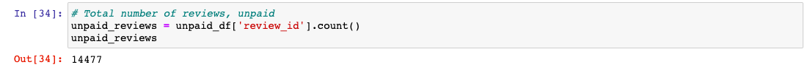

# Amazon_Vine_Analysis

## Overview of Analysis

The purpose of this analysis is to determine if there is any bias toward favorable reviews from Amazon Vine members(paid vs. unpaid members). The Amazon Vine program is a service that allows manufacturers and publishers to receive feedback about their products. In this instance, SellBy, a company participating in the Vine program, is paying Amazon a small fee to provide products to Vine members who are then required to publish a review. 50 different datasets of various products were provided to perform this analysis. The one chosen for this project was a database of Musical Instrument products. 

To perform this analysis, the first step is to create a RDS(database) instance on AWS(Amazon Web Services). Next, using Google Colaboratory, the data was extracted using PySpark and then transformed into four DataFrames: customers_table, products_table, review_id_table and vine_table. These DataFrames were then written into pgAdmin(postgreSQL) from Google Colaboratory. Last, using Jupyter Notebook and Pandas, an analysis was performed to determine: the total number of reviews, the number of 5 star reviews and the percentage of 5 star reviews for both paid and unpaid reviewers.

## Results

- Paid Reviews

There were a total of 60 paid reviews. 

- Paid 5 star Reviews

Out of the total of 60 paid reviews, 34 were rated 5 stars.

- Paid Percentage

Approximately 56.66% of reviews were rated 5 stars.

- Unpaid Reviews

There were a total of 14,477 unpaid reviews. 

- Unpaid Five Star Reviews

Out of the total of 14,447 reviews, 8,212 were rated 5 stars.

- Unpaid Percentage

Approximately 56.72% of reviews were rated 5 stars.

## Summary 

Given that the percentage of 5 star reviews were same for Vine and Non-Vine users, there is insufficient evidence to say that there is any positivity bias for the Vine program. In additional metric that could be helpful for this analysis is a visualization of reviews for Vine and Non-Vine users. A simple bar graph could reveal any skew in the data for either user type. 

## Resources

1. Pandas.core.groupby.dataframegroupby.agg¶. pandas.core.groupby.DataFrameGroupBy.agg - pandas 0.22.0 documentation. (n.d.). Retrieved April 1, 2023, from https://pandas.pydata.org/pandas-docs/version/0.22/generated/pandas.core.groupby.DataFrameGroupBy.agg.html 

2. ankthon. (2020, October 1). Ways to filter pandas DataFrame by column values. GeeksforGeeks. Retrieved April 1, 2023, from https://www.geeksforgeeks.org/ways-to-filter-pandas-dataframe-by-column-values/# 